### Contents

1. [Настройка gitlab-runner](#part-1-настройка-gitlab-runner)  
2. [Сборка](#part-2-сборка)  
3. [Тест кодстайла](#part-3-тест-кодстайла)   
4. [Интеграционные тесты](#part-4-интеграционные-тесты)  
5. [Этап деплоя](#part-5-этап-деплоя)  
6. [Дополнительно. Уведомления](#part-6-дополнительно-уведомления)

### Part 1. Настройка **gitlab-runner**

**== Задание ==**

#### Поднять виртуальную машину *Ubuntu Server 20.04 LTS*
*Будьте готовы, что в конце проекта нужно будет сохранить дамп образа виртуальной машины*

Поднял виртуальную машину
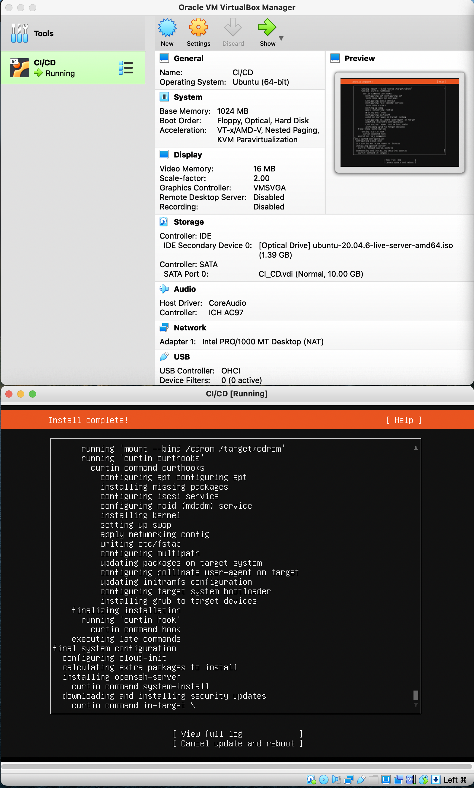

Пробросил порты и закинул ssh ключ на машину с помощью `ssh-copy-id darrpama@localhost -p 2224`. Теперь можно подключаться к машине из консоли с помощью команды `ssh darrpama@localhost -p 2224` без ввода пароля.
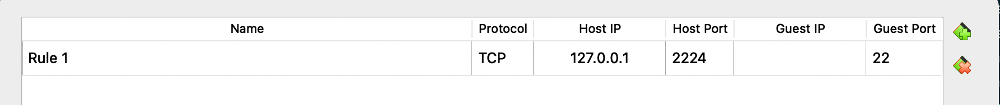
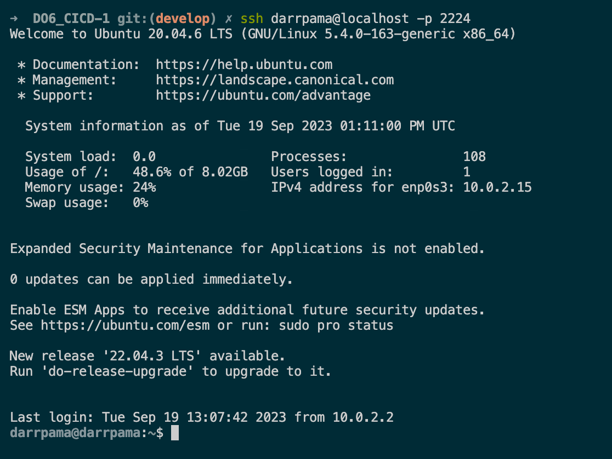

На виртуальной машине был установлен openssh-server.

#### Скачать и установить на виртуальную машину **gitlab-runner**

#### Запустить **gitlab-runner** и зарегистрировать его для использования в текущем проекте (*DO6_CICD*)
- Для регистрации понадобятся URL и токен, которые можно получить на страничке задания на платформе.

Командой `apt install gitlab-runner` установил эту утилиту.
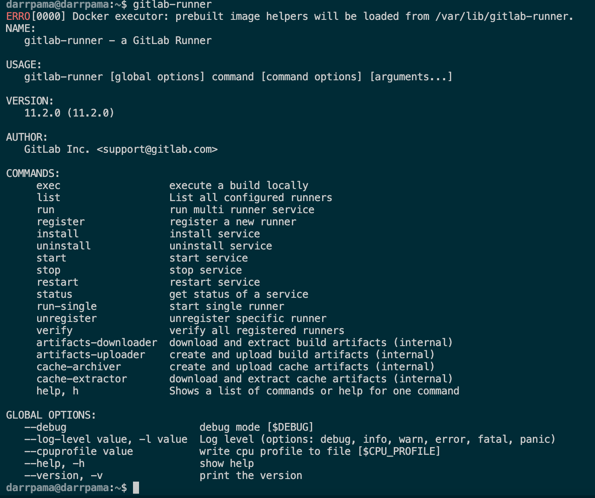

Оказалось, что версия gitlab-runner из репозитория убунты слишком старая, нужно её обновить:
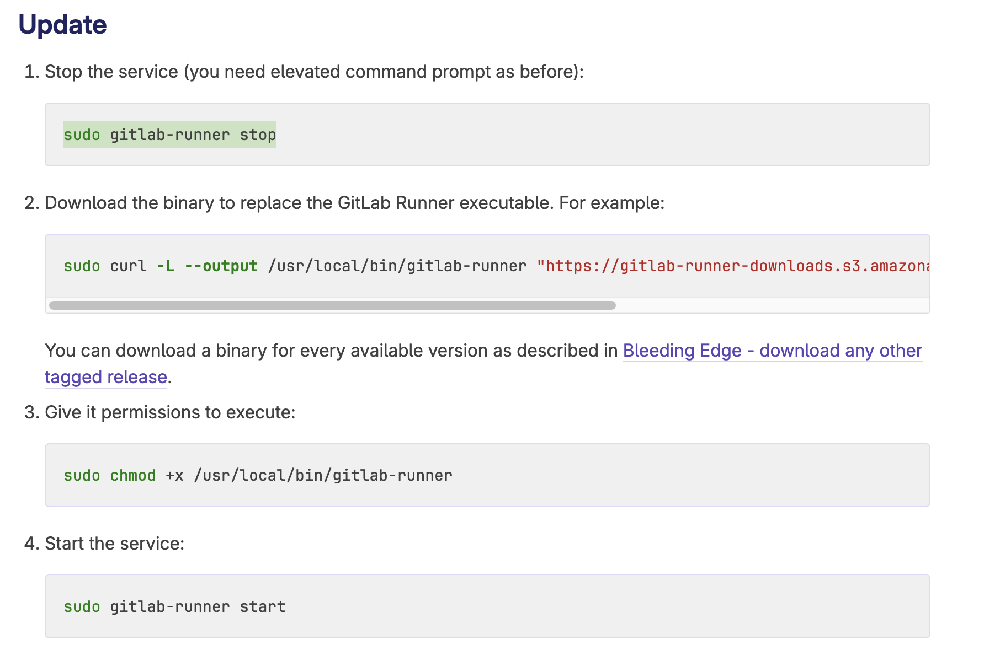

Процесс обновления на виртуалке:
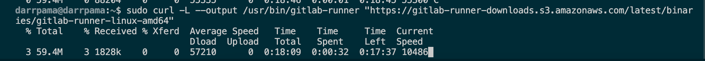

Нашёл на странице с заданием URL и токен для регистрации.
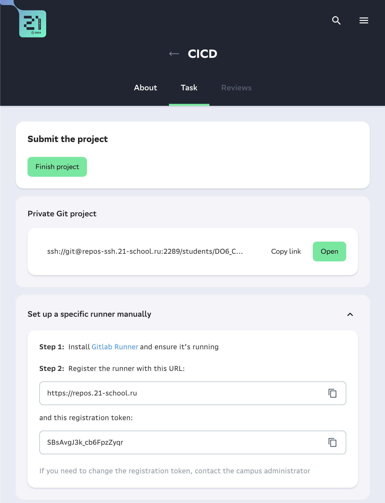

В документации `https://docs.gitlab.com/runner/commands/` нашёл раздел, описывающий команды для регистрации.
Пробую интерактивную регистрацию:
`gitlab-runner register --name my-runner --url "https://repos.21-school.ru" --registration-token SBsAvgJ3k_cb6FpzZyqr`

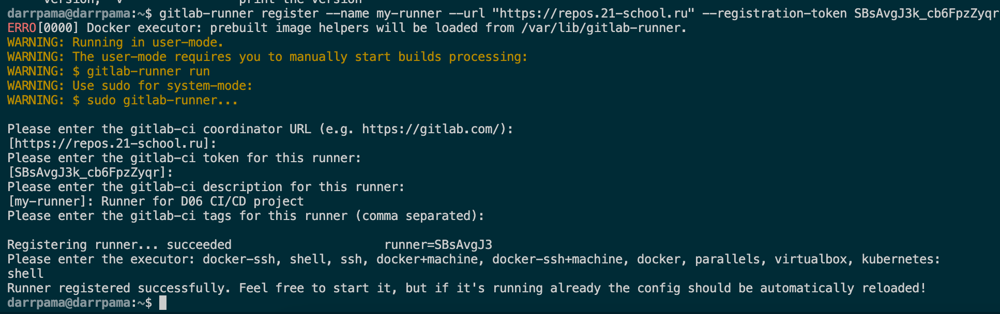
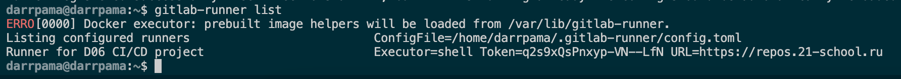

С помощью команды `gitlab-runner verify` можно проверить статус раннера.


### Part 2. Сборка

**== Задание ==**

#### Написать этап для **CI** по сборке приложений из проекта *C2_SimpleBashUtils*:

##### В файле _gitlab-ci.yml_ добавить этап запуска сборки через мейк файл из проекта _C2_

##### Файлы, полученные после сборки (артефакты), сохранять в произвольную директорию со сроком хранения 30 дней.

В корне проекта создал файл `.gitlab-ci.yml`, добавил в него стадию build, где c помощью скрипта перехожу в папки с мейкфайлами и вызываю цели для сборки 
```bash
stages:
  - build

build-code-job:
  stage: build
  script:
    - cd src/cat && make
    - cd ../../src/grep && make
  artifacts:
    paths:
      - src/cat/s21_cat
      - src/grep/s21_grep
    expire_in: 30 days
```

После того как я запушил изменения в ветку девелоп в гитлабе появилась информация о том, что билд провалился:


Щёлкаем по failed и попадаем вовнутрь пайплайна:
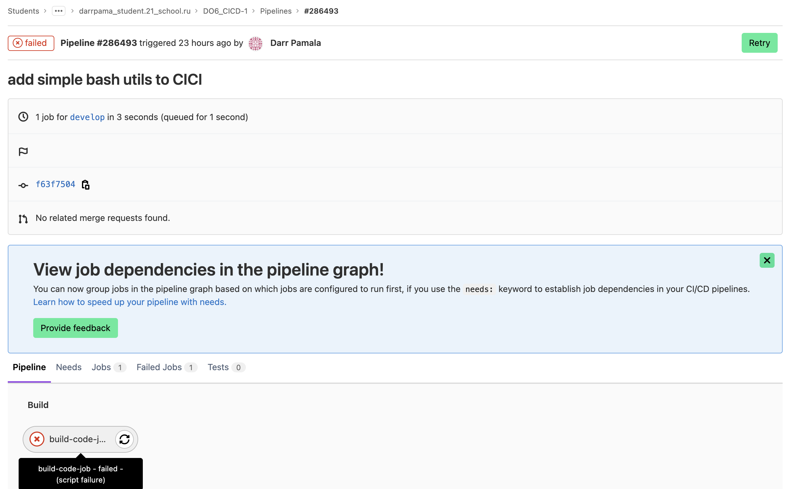

Щёлкаем по build-code-job и видим что там не получилось:
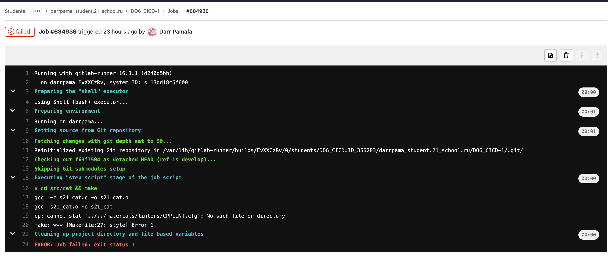

Ага, у нас на маке не нашёлся файл CPPLINT.cfg
Пришлось добавить его в папку materials/linters
Также на виртуальной машине сразу устанавливаем необходимый для CPPLINT python3, gcc для сборки и библиотеку check.h, которую использовали при проверке проекта. В репозитории убунты есть только старая версия библиотеки <check.h>, так что надо устанавливать её вручную. (Я просто закомментировал тесты с этой библиотекой, чтобы не тратить на это время).

```bash
stages:
  - build

build-code-job:
  stage: build
  script:
    - cd src/cat && make s21_cat
    - cd ../../src/grep && make s21_grep
  artifacts:
    paths:
      - src/cat/s21_cat
      - src/grep/s21_grep
    expire_in: 30 days
```

Теперь всё ок:
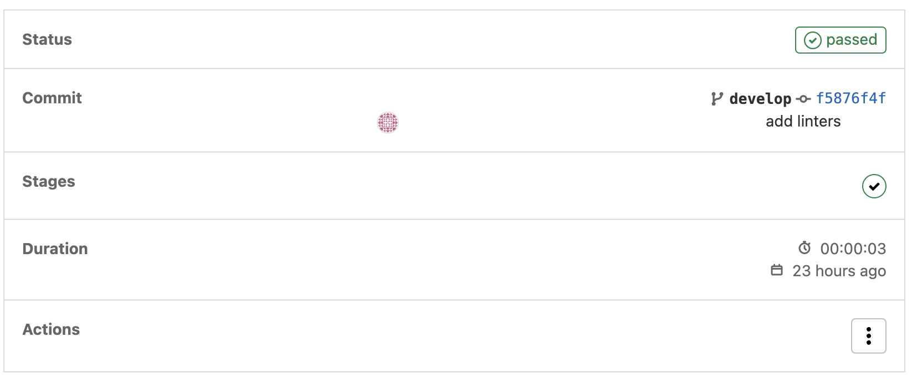


### Part 3. Тест кодстайла

**== Задание ==**

#### Написать этап для **CI**, который запускает скрипт кодстайла (*clang-format*):

##### Если кодстайл не прошел, то "зафейлить" пайплайн

##### В пайплайне отобразить вывод утилиты *clang-format*

Модифицировал файл `.gitlab-ci.yml`, добавив в него этап проверки на стиль:
```bash
stages:
  - build
  - style

build-code-job:
  stage: build
  script:
    - cd src/cat && make s21_cat
    - cd ../../src/grep && make s21_grep
  artifacts:
    paths:
      - src/cat/s21_cat
      - src/grep/s21_grep
    expire_in: 30 days
    
style-code-job:
  stage: style
  script:
    - cd src/cat && make style
    - cd ../../src/grep && make style
```

Делаем коммит...

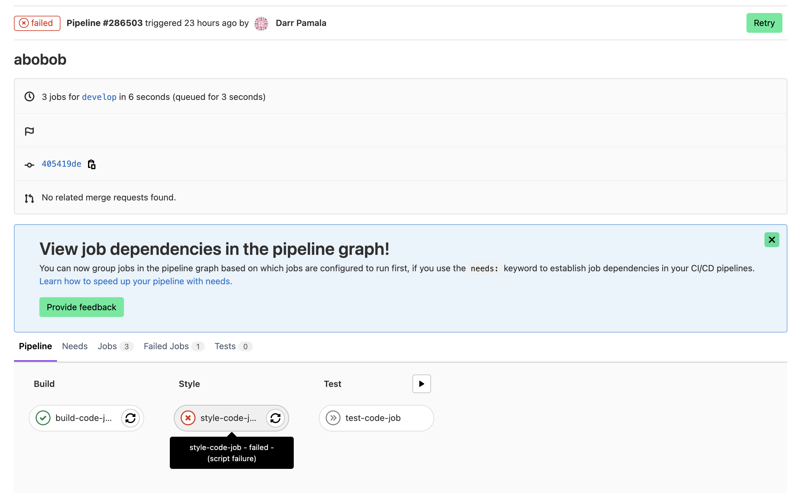

Провал, идём разбираться почему:

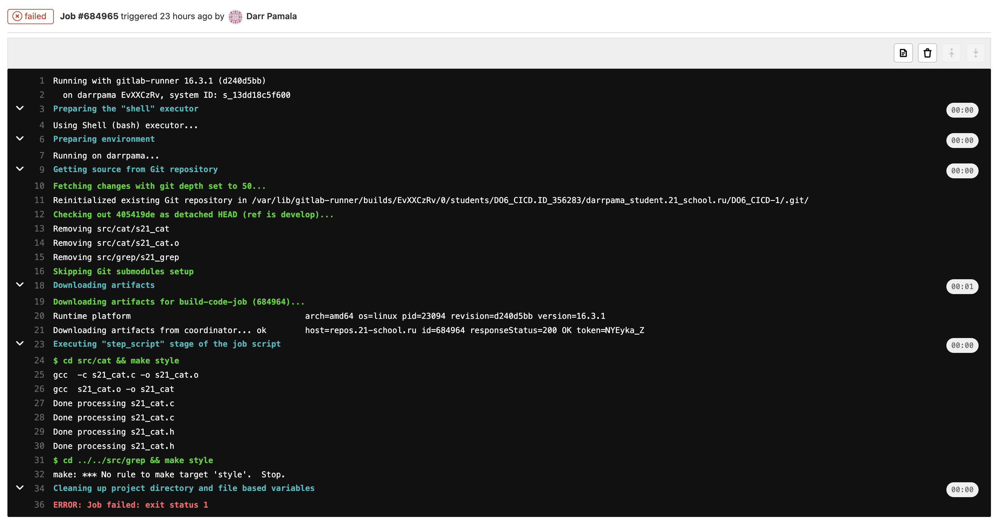

Оказывается что для грепа нет цели style, допишем её и пробуем закоммитить изменения.

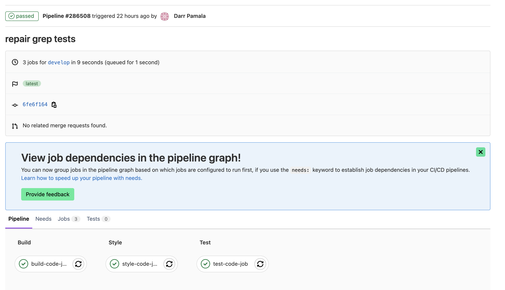


### Part 4. Интеграционные тесты

`-` Отлично, тест на кодстайл написан. [ТИШЕ] Говорю с тобой тет-а-тет. Не говори ничего коллегам.
Между нами: ты справляешься очень хорошо. [ГРОМЧЕ] Переходим к написанию интеграционных тестов.

**== Задание ==**

#### Написать этап для **CI**, который запускает ваши интеграционные тесты из того же проекта:

##### Запускать этот этап автоматически только при условии, если сборка и тест кодстайла прошли успешно

##### Если тесты не прошли, то "зафейлить" пайплайн

##### В пайплайне отобразить вывод, что интеграционные тесты успешно прошли / провалились

Скрипт получился такой:
```bash
stages:
  - build
  - style
  - test

build-code-job:
  stage: build
  script:
    - cd src/cat && make s21_cat
    - cd ../../src/grep && make s21_grep
  artifacts:
    paths:
      - src/cat/s21_cat
      - src/grep/s21_grep
    expire_in: 30 days
    
style-code-job:
  stage: style
  script:
    - cd src/cat && make style
    - cd ../../src/grep && make style

test-code-job:
  stage: test
  script:
    - cd src/cat && make test
    - cd ../../src/grep && make test
  when: on_success
```

В гитлабе всё заработало:
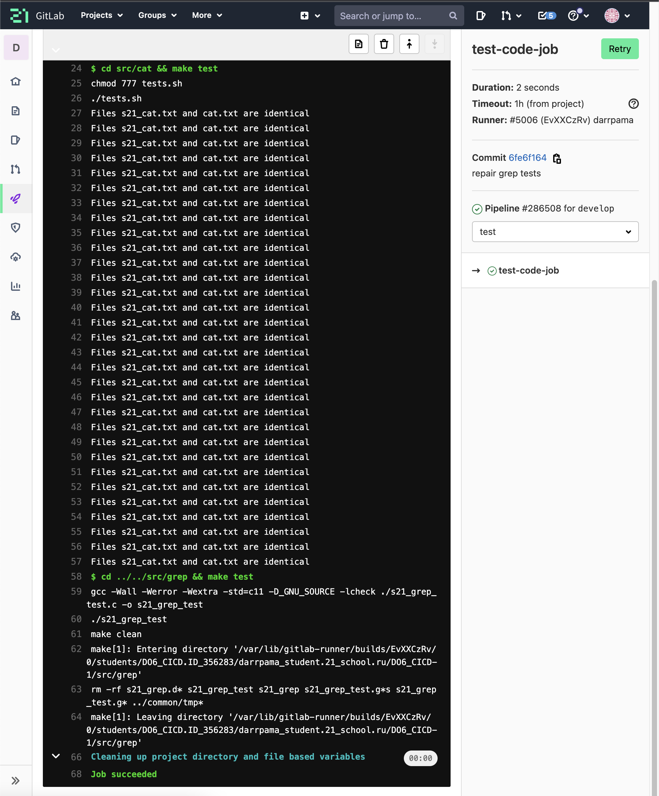

### Part 5. Этап деплоя

**== Задание ==**

##### Поднять вторую виртуальную машину *Ubuntu Server 20.04 LTS*

#### Написать этап для **CD**, который "разворачивает" проект на другой виртуальной машине:

##### Запускать этот этап вручную при условии, что все предыдущие этапы прошли успешно

##### Написать bash-скрипт, который при помощи **ssh** и **scp** копирует файлы, полученные после сборки (артефакты), в директорию */usr/local/bin* второй виртуальной машины
*Тут вам могут помочь знания, полученные в проекте DO2_LinuxNetwork*

- Будьте готовы объяснить по скрипту, как происходит перенос.

##### В файле _gitlab-ci.yml_ добавить этап запуска написанного скрипта

##### В случае ошибки "зафейлить" пайплайн

В результате вы должны получить готовые к работе приложения из проекта *C2_SimpleBashUtils* (s21_cat и s21_grep) на второй виртуальной машине.

##### Сохранить дампы образов виртуальных машин
**p.s. Ни в коем случае не сохранять дампы в гит!**
- Не забудьте запустить пайплайн с последним коммитом в репозитории.

Поднимаем вторую машину:
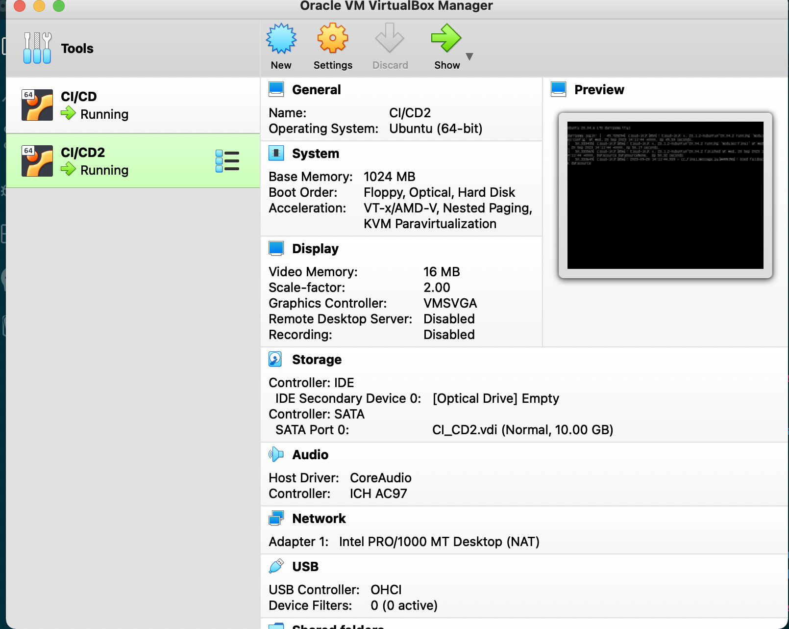

Пробуем задеплоить на другую машину:
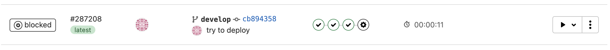

Ничего не заработало
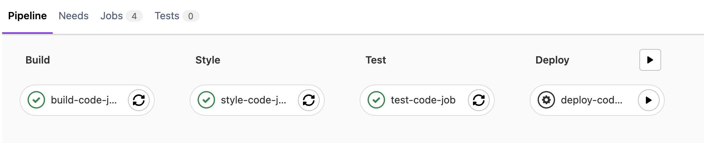

Смотрим что не так:
У нас не работает scp
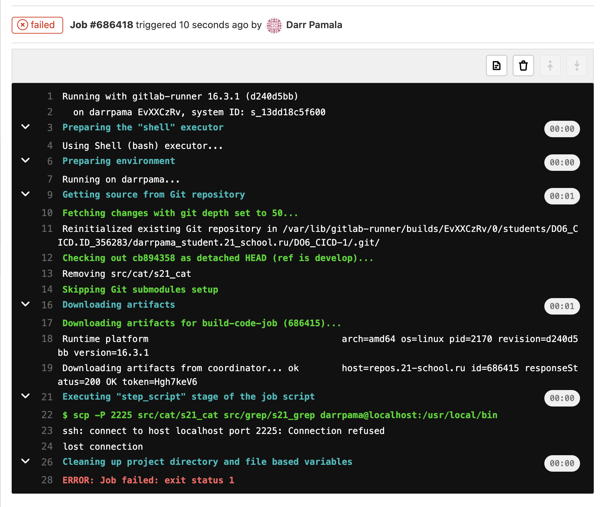

Пробрасываем порты:
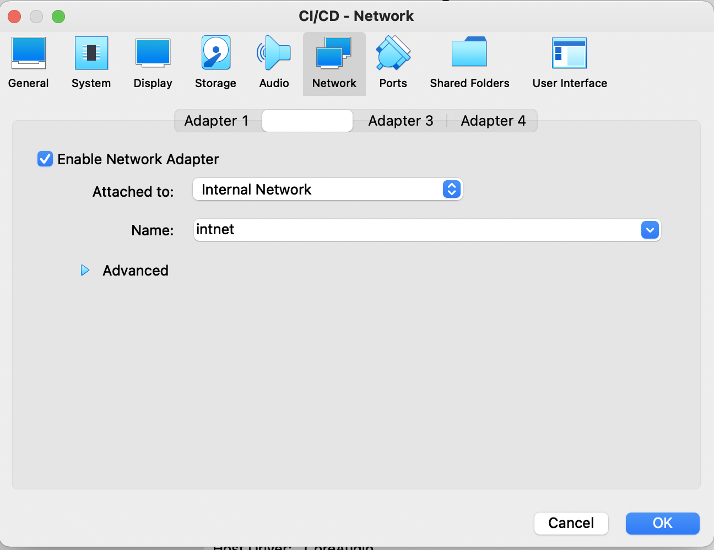
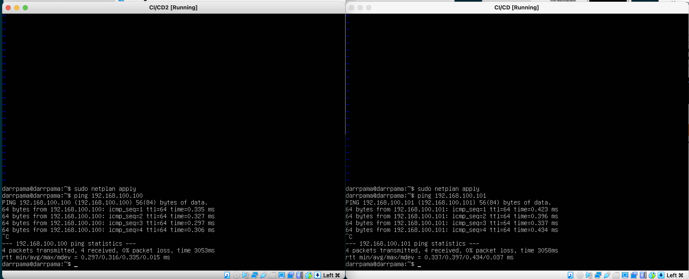


Важно! После проброса портов обязательно:
- на машине где деплоим проект сменить пользователя на gitlab-runner: `sudo su -l gitlab-runner -s /bin/bash`
- создать ssh ключ и закинуть его с помощью ssh-copy-id на вторую машину: `ssh-keygen` и `ssh-copy-id darrpama@192.168.100.101`
- на машине куда отправляем файлы дать права суперпользователя нашему юзеру, от чьего имени происходит логин: `sudo usermod -aG sudo darrpama`
- на машине куда отправляем файлы дать права на изменение папки /usr/local/bin: `sudo chmod 777 /usr/local/bin`

Теперь scp будет нормально работать и копировать файлы в системную папку!

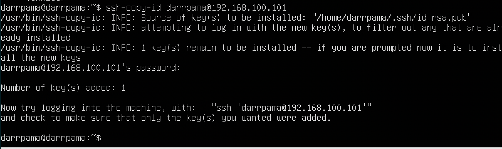


### Part 6. Дополнительно. Уведомления

**== Задание ==**

##### Настроить уведомления о успешном/неуспешном выполнении пайплайна через бота с именем "[ваш nickname] DO6 CI/CD" в *Telegram*

- Текст уведомления должен содержать информацию об успешности прохождения как этапа **CI**, так и этапа **CD**.
- В остальном текст уведомления может быть произвольным.

Пишем BotFather для получения токена и регистрации бота:

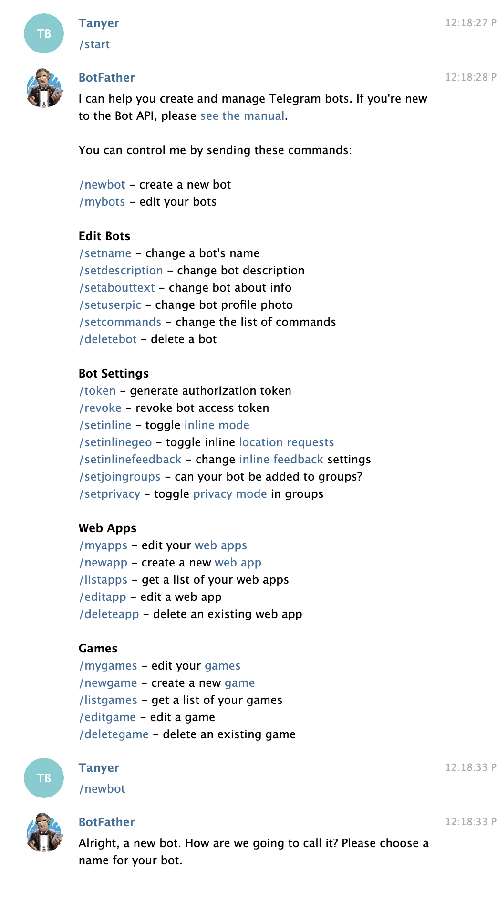

Допиливаем `.gitlab-ci.yml` и добавляем скрипт `notifications.sh` с отправкой уведомлений
```bash
stages:
  - build
  - style
  - test
  - deploy


build-code-job:
  stage: build
  script:
    - cd src/cat && make s21_cat
    - cd ../../src/grep && make s21_grep
  artifacts:
    paths:
      - src/cat/s21_cat
      - src/grep/s21_grep
    expire_in: 30 days
  after_script:
    - chmod +x notifications.sh && bash notifications.sh
    
style-code-job:
  stage: style
  script:
    - cd src/cat && make style
    - cd ../../src/grep && make style
  after_script:
    - chmod +x notifications.sh && bash notifications.sh

test-code-job:
  stage: test
  script:
    - cd src/cat && make test
    - cd ../../src/grep && make test
  when: on_success
  after_script:
    - chmod +x notifications.sh && bash notifications.sh

deploy-code-job:
  stage: deploy
  when: manual
  script:
    - scp src/cat/s21_cat darrpama@192.168.100.101:/usr/local/bin
    - scp src/grep/s21_grep darrpama@192.168.100.101:/usr/local/bin
  allow_failure: false
  after_script:
    - chmod +x notifications.sh && bash notifications.sh
```


```bash
#!/bin/bash

URL="https://api.telegram.org/bot$TELEGRAM_BOT_CICD_TOKEN/sendMessage"
TEXT="Stage: $CI_JOB_STAGE\nStatus: $CI_JOB_STATUS\nProject: $CI_PROJECT_NAME\nURL: $CI_PROJECT_URL/pipelines/$CI_PIPELINE_ID/\nBranch: $CI_COMMIT_REF_SLUG\nName: $CI_JOB_NAME"

curl -s -o /dev/null -X POST -H "Content-Type: application/json" -d "{\"chat_id\": \"919080702\", \"text\": \"$TEXT\", \"disable_notification\": false}" $URL
```


Чтобы начали приходить уведомления надо добавить в переменные при запуске скрипта `$TELEGRAM_BOT_CICD_TOKEN`
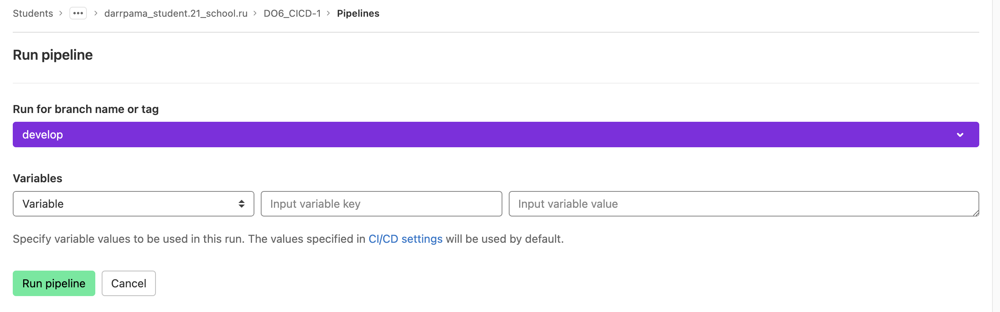

Первые попытки:
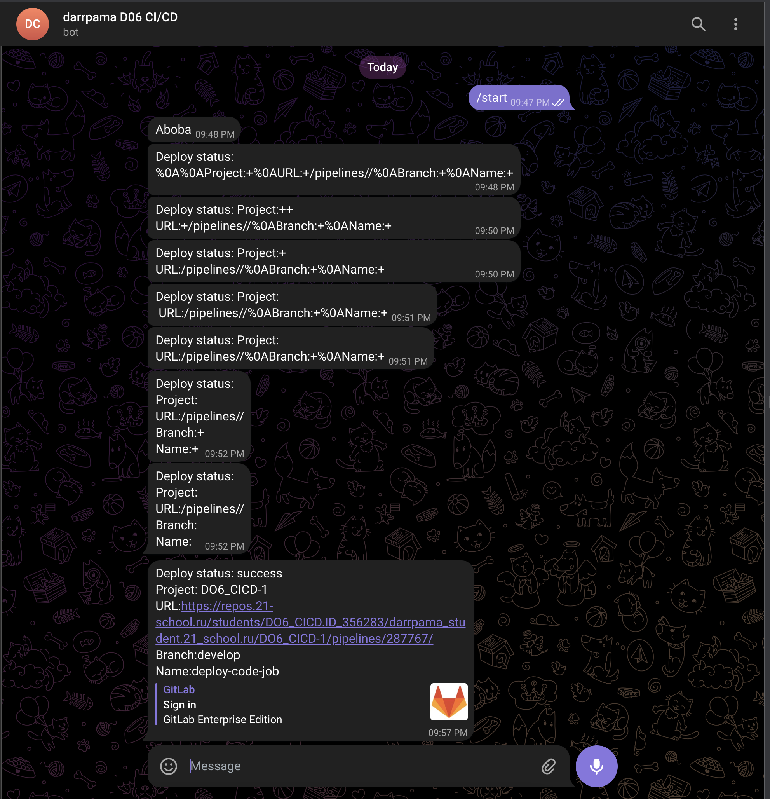

Дописанный скрипт:
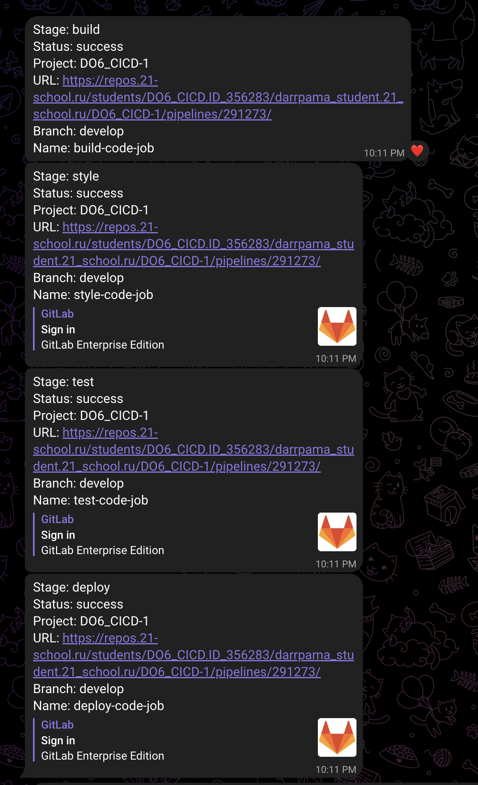